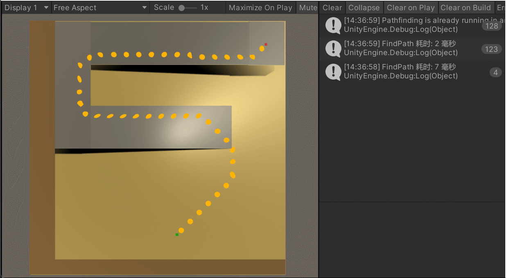
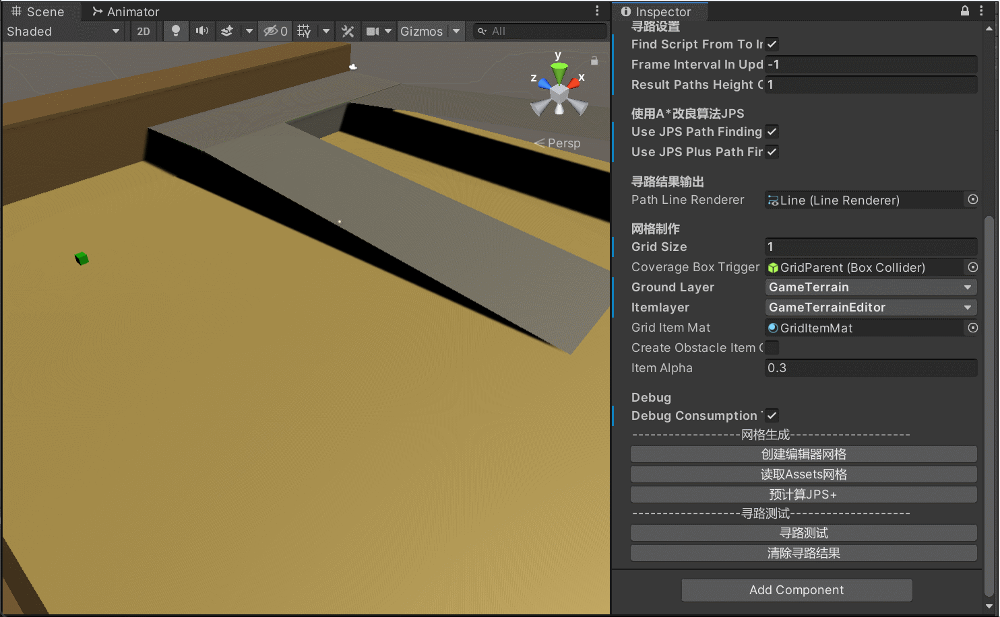

# Unity Simple PathFinding

**A Simple Unity AStar / JSP / JSP+ PathFinding Plugins**

  

  
  

## Simple And Efficient

  

## MapEditor

### Grid and Obstacles

  

### JSP+ Debuger

  

### Conclusion

This may **not** be the best pathfinding system. It doesn't support multi-level navigation in height or teleport points. But it's simple enough for me to easily implement A*, JPS, and JPS+ pathfinding. You can also further develop it based on this, can't you?